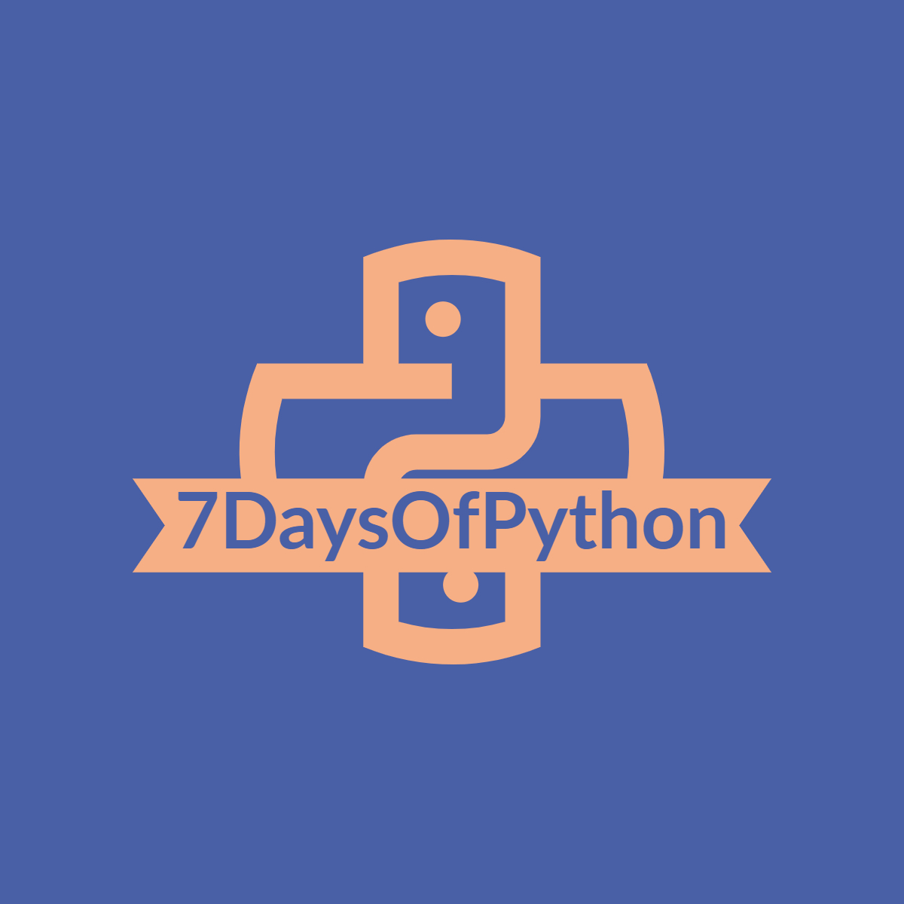

# 7 Days of Python

## Disclaimer

Hey there, I'd like to start by saying that I created this repository as a resource for those who are new to Python and want to learn it for Cloud Computing or DevOps career. However, I'd like to emphasise that using you cannot become a Python expert in 7 days, and this repository does not automatically turn you into a Python expert. It is only a starting point for you to gain a basic understanding of the language and some related concepts. Python is a vast and ever-changing language, and becoming an expert takes time and practise. I hope this disclaimer clears up any misunderstandings and assists you in approaching this resource with realistic expectations. Happy studying!

## Start here

| Days      | Topic |
| ----------- | ----------- |
| Day 1   | [Introduction to Python](docs/days/day1.md)       |
| Day 2   | [Python Loops, functions, modules and libraries](docs/days/day2.md)        |
| Day 3   | [Python Data Structures and OOP](docs/days/day3.md)       |
| Day 4   | [Debugging, testing and Regular expression](docs/days/day4.md)        |
| Day 5   | [Web development in Python](docs/days/day5.md)       |
| Day 6   | [Automation with Python](docs/days/day6.md)        |
| Day 7   | [Let's build an App in Python](docs/days/day7.md)        |

## License

[MIT License](LICENSE)

## Deployed on

